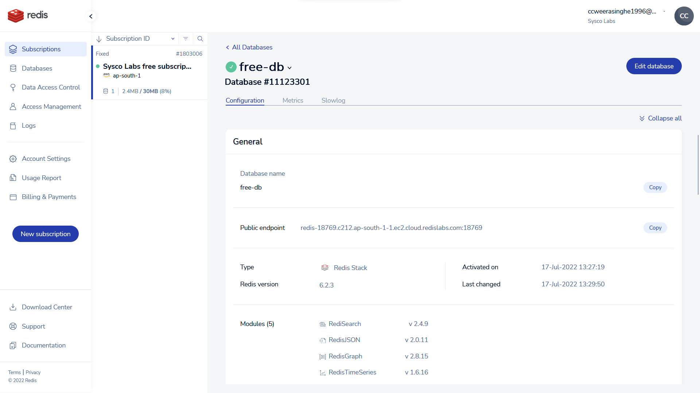

# Get Started here

- [Get Started here](#get-started-here)
  - [Why Use Redis](#why-use-redis)
    - [redis is super fast because](#redis-is-super-fast-because)
    - [the second reason redis is fast](#the-second-reason-redis-is-fast)
    - [the third reason](#the-third-reason)
  - [Initial Setup](#initial-setup)
  - [Touch More Setup](#touch-more-setup)

## Why Use Redis

redis is fast.

we use redis because it is fast.

### redis is super fast because

let's look at a traditional database.

let's look at a redis database.

getting data from a hard drive is slow compare to getting data from a memory.

there is a clear downside to using a in-memory database.
if you have a large dataset, you will have to read the entire dataset into memory.
so there is a limitation to that.

### the second reason redis is fast

### the third reason

therefor we have to learn redis in a different way.

## Initial Setup

for the initial setup we will use redis.com
create a account and a subscription. then create a database

## Touch More Setup

we will use the above cloud database.

